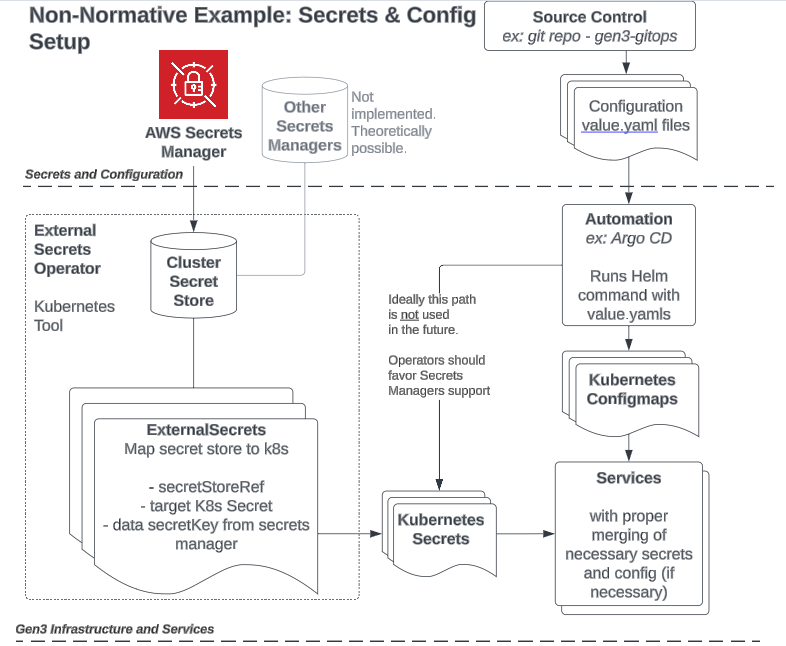

# Gen3 using helm in production


The postgres and helm charts are included as conditionals in the Gen3 [umbrella chart](https://helm.sh/docs/howto/charts_tips_and_tricks/#complex-charts-with-many-dependencies)

```
- name: elasticsearch
  version: "0.1.3"
  repository: "file://../elasticsearch"
  condition: global.dev
- name: postgresql
  version: 11.9.13
  repository: "https://charts.bitnami.com/bitnami"
  condition: global.dev
  ```

### Kubernetes Configmap and Secret Configuration
For the seamless operation of our services, we utilize Kubernetes secrets. To streamline the integration and management of these secrets, we highly recommend deploying External Secret Manager alongside any existing secret management systems you may already have in place. For a comprehensive guide and best practices on implementing External Secrets within our ecosystem, please consult our dedicated External Secrets Documentation available [here](https://github.com/uc-cdis/gen3-helm/blob/master/docs/external_secrets.md).

Our services also utilize non-secret configuration variables provided via Kubernetes ConfigMaps. For streamlined management, we advise keeping your values.yaml and configuration files files in source control and utilizing ArgoCD for automatic updates and efficient management of your Gen3 Helm chart.

Each service is designed to seamlessly integrate and manage the combination of Kubernetes secrets and ConfigMaps, ensuring the encapsulated information is effectively injected into the underlying application.

Please see the diagram provided that details how External Secrets operates. We also mention the use of Argo CD as our choice option for Helm deployments. 


