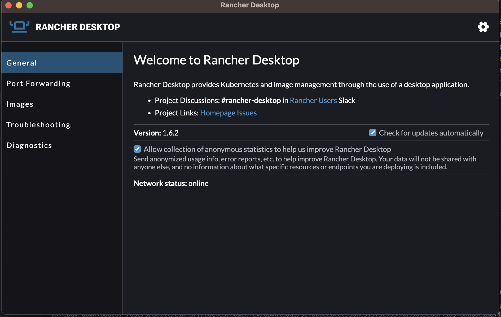

# Running Gen3 On A Laptop, For Devs

Welcome to Gen3! 

If you're reading this, I assume you're a developer looking to get started working with Gen3. If so, this guide will help you get an instance of Gen3 up and running on your laptop, which will let you work on Gen3 from anywhere you can write code, no other setup needed. 


# Kubernetes
Gen3 runs entirely on Kubernetes. Kubernetes is a container orchestrator, and you'll often see it referred to as k8s, or 'k', followed by the 8 letters in 'ubernete', followed by 's'. It is responsible for managing the lifecycle, storage, and networking for a collection of containers, which are packaged into discrete units called "pods". 

If you're not familiar with containers, they're a set of technologies that allow you to run code inside isolated environments on your machine. This provides benefits such as allowing you to manage "machnes" that only exist in software, instead of physical hardware, and isolating applications from each other, to prevent failures from affecting other applications or even all applications on your machine. These are the basic units software that Kubernetes starts up, stops, and schedules, in order to match a state that you define and provide it. 

Kubernetes is primarly meant to run on cloud services, and the big 3 (Amazon Web Services, Microsoft Azure, and Google Cloud) all have robust offerings. While it is designed to run primarily on the cloud, for the sake of developers' ability to work almost anywhere, there are versions (also called flavors) of Kubernetes designed primarily with the laptop or local desktop in mind. The next section will introduce you to the one we'll recommend you use, Rancher Desktop. However you can use another flavor if you think it works better, so long as you can follow the rest of these directions while using them.  

### Installing `kubectl`
Kubectl (I pronounce it cube-cuddle, but others say it differently) is an application that allows you to interface with and control a Kubernetes cluster. In this context, "cluster" simply refers to a group of machines, which can be a group of one, that work together to manage containers. 

It will be an important tool for you as you get more comfortable working with Kubernetes, so we'll install it now. It is a highly-configurable tool that you can install in a lot of ways, so rather than tell you how to do it, we'll let you pick the method that works best for your platform: [Windows](https://kubernetes.io/docs/tasks/tools/install-kubectl-windows) [Mac](https://kubernetes.io/docs/tasks/tools/install-kubectl-macos) [Linux](https://kubernetes.io/docs/tasks/tools/install-kubectl-linux). 

Once you have kubectl installed, you can verify by running `kubectl`. The output should be a help guide. 

### Installing `helm`
Helm is a package manager for Kubernetes that makes it easy to install, upgrade, and manage applications on a Kubernetes cluster. It simplifies the process of installing and configuring complex applications by providing a set of pre-configured templates and options. In this guide, we will show you how to install the Helm command-line interface (CLI) on your machine.

The installation steps for Helm are rather straightforward. If you're a Homebrew user on Mac, you can use the command `brew install helm` to get it on your machine. If not, head over to the Helm website [here](https://helm.sh/docs/intro/install/) and follow the instructions for your setup. You'll know you've set it up correctly if the output of running the command `helm list` looks like this:


This means that Helm was able to connect to your Rancher k8s cluster, and will be able to install Gen3 in the next step.


### Kubernetes on your laptop
There are several ways to run Kubernetes on your laptop, depending on your needs and the resources available on your machine. Some of the most popular options include:

**Minikube:** Minikube is a lightweight Kubernetes distribution that runs a single-node cluster on your laptop. It is easy to set up and is well suited for local development and testing.

**Docker for Desktop:** Docker for Desktop includes built-in support for Kubernetes, allowing you to run a single-node cluster on your laptop using the Docker engine. This option is also easy to set up and is well suited for local development and testing.

**k3s:** k3s is a lightweight Kubernetes distribution that is designed to run on resource-constrained environments. It is a great option for running Kubernetes on your laptop if you have limited resources or need to run multiple clusters.

**Kind (Kubernetes in Docker):** Kind is a tool for running local Kubernetes clusters using Docker container “nodes”. It creates a cluster by starting multiple Docker containers on the local host.

**Microk8s:** Microk8s is a fast and efficient Kubernetes distribution that is easy to install and run on a local machine. It uses snaps to package and distribute Kubernetes, making it a great option for users on Ubuntu and other Linux distributions.

**Vagrant and Virtualbox:** Vagrant is a tool that enables you to create and configure lightweight, reproducible, and portable development environments. You can use it to create a virtual machine running Kubernetes on your laptop using Virtualbox.

Each of these methods has its own advantages and disadvantages, so you should choose the one that best fits your needs.

Another option to run Kubernetes on your laptop is **Rancher Desktop.**

**Rancher Desktop** is an easy-to-use, all-in-one Kubernetes platform that runs on your local machine. It provides a simple and intuitive UI for managing your local Kubernetes cluster, and includes built-in support for Ingress, cert-manager, and other popular add-ons. Rancher Desktop also comes with a built-in Kubernetes dashboard and a set of tools for managing and monitoring your cluster.

**Rancher Desktop** is our preferred way of running Kubernetes on a laptop, because it provides a user-friendly interface and comes with many pre-configured components, which make it easy to set up and manage your cluster. Additionally, it works well on M1 macbooks, which have new ARM-based processors.


### Installing Rancher Desktop
This guide is primarily written with Mac users in mind, but most Linux users should be able to install Rancher Desktop using their distro's package manager. If you're on Mac and using Homebrew, you can type `brew install --cask rancher`. If not, install directions for Linux, Mac, and Windows are available at [the Rancher website.](https://docs.rancherdesktop.io/getting-started/installation/#macOS) Once you have Rancher succesfully installed and the application opened, we can go over how to get your Kubernetes cluster ready for Gen3!

### Configuring Rancher Desktop


Once you can see a blank screen like this, you are ready to begin. If you can't get a screen similar to this, without any warnings, reach out to a Gen3 resource, either the community, or the platform team if you work directly for us. Now, we're going to make a few small tweaks to help Kubernetes run better.

Click on the gear icon in the top right of your window, then navigate to "virtual machine." These settings control the VM that Kubernetes is going to run on on your laptop, and so striking a the right balance between performance and resource usage is key.

This guide was developed by people mostly using M1 Macbook Pros with 16GB of RAM and and 8 CPU cores. In a similar situation, this guide recommends allocating half of each (so 8GB of RAM/4 CPU cores) to allow you to run other applications while still deploying all of our services quickly.

Once you've settled on a CPU and RAM allocation, click on the "Kubernetes" tab. Make sure that Kubernetes is enabled, and the version is set appropriately (if you're not sure, just leave it default).

Now that you have these steps out of the way, in our next step, we'll install Helm onto our laptop. Helm is a tool for packaging Kubernetes services, much like a Linux package manager or Homebrew for Mac. This will allow us to more easily install Gen3 onto our laptops. 


### Installing Gen3
The first step to installing Gen3 is adding the Gen3 Helm repository. This is just how we package up all the components that make up Gen3, and make them accessible to the public. 

The command to do this is: 

```
helm repo add gen3 http://helm.gen3.org
helm repo update
```

Once you have your repo added, you can install it with the command 

```
helm upgrade --install dev gen3/gen3 
```

If you want to provide overrides you can do so by passing in one, or several values.yaml files. F.ex if you want to pass in user.yaml and fence-config (NB! New format, check out sample files in [this](../sample-values/) folder)

```
helm upgrade --install dev gen3/gen3  -f values.yaml -f fence-config.yaml -f user.yaml
```


See example files:
- [values.yaml](../sample-values/values.yaml)
- [fence-config.yaml](../sample-values/fence-config.yaml)
- [user.yaml](../sample-values/user.yaml)


You can combine it all in a single file too if that's easier. 

This command calls out to the repository you created before, named `gen3`, and grabs an "umbrella chart" containing all the services needed to run Gen3. 

Confusingly, this umbrella chart is also called `gen3`, and these two parts combine to form the `gen3/gen3` in the command you see. 

The first `dev` in that command refers to the "release name," or what Helm will call the deployment of Gen3 on your laptop. If that command runs successfully, you will see an output like this: 


### Accessing Gen3 
If everything went well with deploying you should now have an ingress resource, listening for the hostname you provided. 

```
kubectl get ingress
```

If you used Rancher Desktop, and used localhost as your hostname, you should be able to access your application at `https://localhost/` 


# Nice to have tools
Another way to interact with and manage a Kubernetes cluster on your laptop is by using command-line tools, such as k9s. k9s is a terminal-based tool that provides a simple and intuitive UI for interacting with your local Kubernetes cluster. It includes features such as pod management, resource monitoring, and log viewing. k9s also provides a live view of your cluster, making it easy to identify and troubleshoot issues.

Other similar tools for developers include:

- Stern: a multi-pod and container log tailing for Kubernetes
- Kube-ps1: a Kubernetes prompt for bash and zsh
- Kube-shell: An integrated shell for working with the Kubernetes CLI
- Skaffold: a command line tool that facilitates continuous development for Kubernetes applications.


These command-line tools can be a great option for developers who prefer to work in the terminal and want a more streamlined and efficient way to interact with their cluster. They are lightweight, easy to install and have a small footprint. They provide a simple and efficient way to manage and monitor your cluster.


